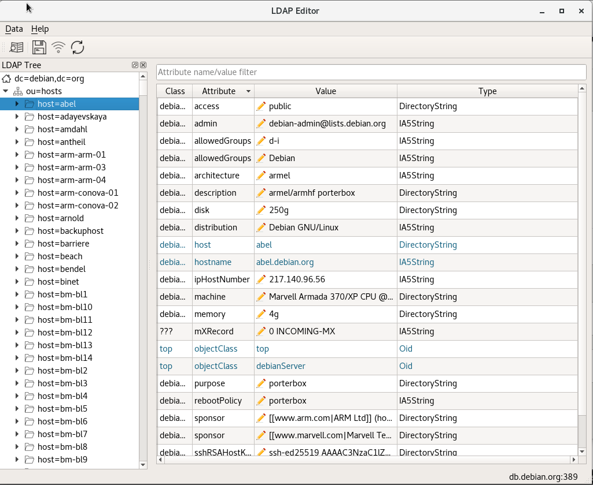

# QLdapEditor
LDAP Editor based on Qt and ldapc++ wrapper

## Feature list
### Connection to LDAP server
* Connect to LDAP server using different settings
  * Anonymous connection
  * Simple authenticated connection
  * TLS authenticated connection 
* Show list of previous successful connections
* Save last used successful connection settings
* load last used succesful connection settings on start
* Reconnect to server
### Browse and edit LDAP tree entities
* Add entity to LDAP tree
* Edit entity in LDAP tree
* Delete entity in LDAP tree 
* Refresh LDAP entities tree
* Save/Reject done changes on LDAP server
* Load LDAP tree iteratively by expand tree item action
### Browse anf edit LDAP attributes list
* Add attribute
* Delete attribute
* Use different colors for show May/Must attributes
* Use icon for show editable data
* Filter and sort data in attributes list
### Search LDAP data
* Setup base DN for search
* Setup entity filter for search
* Setup list of attributes to be return
### Manage LDAP User and Group 
* Create user entity
* Change password for user by administrator
* Manage members list (add/remove) in groups
* Lock/Inlock user's account on LDAP server with indication by icon
### Setup package
* Support of RPM setup package for CentOS7
* Add application into 'Utilities' Main menu's group (Gnome/KDE) after installation 
 

## Prepare development environment for CentOS7
- $sudo yum -y install epel-release
- $sudo yum -y install cmake3
- $sudo yum -y install qt5-qtbase-devel
- $sudo yum -y install openldap-devel.x85_64
- $sudo yum -y install openssl-devel
- $wget http://download.qt.io/archive/qt/5.9/5.9.2/qt-opensource-linux-x64-5.8.2.run
- $chmod a+x ./qt-opensource-linux-x64-5.8.2.run
- $./qt-opensource-linux-x64-5.8.2.run

[Fortress LDAP Schema and Config](https://github.com/apache/directory-fortress-core/tree/master/ldap) for reference.
